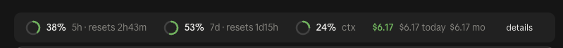

# claude-mods

Three [Claude Code mods](https://claude.dev/blog/getting-started-with-claude-code-mods/): plugins built from function hooks that run inside Claude Code, in the terminal and the desktop app's Code tab.

| Mod | What it does |
| --- | --- |
| [house-rules](plugins/house-rules) | Keeps Claude's git work under your identity: removes AI co-author trailers, renames `claude/` and `ai/` branches, and blocks commits or PRs made as the wrong person |
| [usage-band](plugins/usage-band) | Shows 5-hour and 7-day usage limits, context fill, cost and the git branch in a band above the prompt |
| [lean-comments](plugins/lean-comments) | Stops Claude adding banner, multi-line, long or narrating code comments, so comments only explain a non-obvious why in one short line |

Needs Claude Code 2.1.286 or later.

## Install

```
/plugin marketplace add WilsonKinyua/claude-mods
/plugin install house-rules@wilson-mods
/plugin install usage-band@wilson-mods
/plugin install lean-comments@wilson-mods
/reload-plugins
```

Plugins install at user scope, so they load in every project. Add `--scope project` to `claude plugin install` to turn one on for a single repo instead.

Mods run with the same access as Claude Code. Read the source before you install, as you would with any package.

## house-rules

It checks every Bash command Claude runs, including subagents' commands, before the command executes.

**Corrected automatically** (you get a toast, and Claude is told what actually ran):

- `-c user.email=…`, `-c user.name=…`, `GIT_AUTHOR_*` / `GIT_COMMITTER_*` env vars and any `--author` that isn't yours are removed.
- `Co-authored-by:`, `Generated-by:`, `🤖 Generated with Claude Code` and Claude session links are removed from commit messages and `gh pr` / `gh issue` text.
- A new branch with a blocked prefix is renamed: `git checkout -b claude/fix-login` creates `feat/fix-login`, and a push in the same command follows the rename.

**Blocked, with the reason given to Claude:**

- Pushing an existing branch with a blocked prefix, or opening a PR from one. Claude gets the `git branch -m` command to rename it first.
- `git commit` in a repo whose `user.email` or `user.name` isn't yours.
- `git config user.email` / `user.name` set to anything else.
- `gh pr create` while `gh` is signed in to another account. This check only runs if you set a GitHub login.

### Settings

Set these in `/config`, or from a terminal:

```bash
claude plugin configure house-rules@wilson-mods
```

| Setting | Default | Meaning |
| --- | --- | --- |
| `gitEmail` | your global `user.email` | The only email commits may be authored as |
| `gitNames` | your global `user.name` | Accepted author names, separated by commas |
| `githubLogin` | empty (no check) | The `gh` account allowed to open PRs |
| `blockedBranchPrefixes` | `claude,ai,bot,copilot,codex,…` | Branch prefixes that get renamed or blocked |
| `branchType` | `feat` | The prefix a blocked branch is renamed to |

If one repo should keep a different identity, such as a work email, run this inside that repo yourself:

```bash
git config house-rules.allow-identity true
```

Claude can't set that key; the mod blocks it.

## usage-band



- Rings for the 5-hour and 7-day limits, with reset countdowns. They turn amber at 60% and red at 85%.
- Context window fill.
- Cost of this session, plus today's and this month's totals.
- Current git branch and the number of uncommitted changes.
- A toast when a limit passes 80% and again at 90%.
- `/usage`, or the **details** button, opens a pane with the context breakdown by category and spend per day.

The rings are drawn as SVG in the desktop app and as `◔◑◕` glyphs in the terminal. Limits only appear on a Claude subscription. The today and month totals only count sessions where the mod was loaded.

## lean-comments

It checks every Edit and Write Claude makes. Only comments the change adds are checked; existing comments are left alone. By default a change is refused, with a list of the offending comments, and Claude rewrites it. A comment is flagged when it:

- is a decorative banner or divider, such as `// ── Section ──────` or `# ==========`;
- spans more than one line, including multi-line `/** … */` doc blocks;
- is longer than 120 characters;
- narrates or labels the code, such as `// Step 1: load config` or `# Helpers`.

A change that adds more than 3 new comments is flagged too.

Tool directives are never flagged: `eslint-disable`, `@ts-expect-error`, `noqa`, `# type: ignore`, `prettier-ignore`, `//go:`, shebangs, license headers and similar. Markdown and other prose files are skipped.

It understands comment syntax for JS/TS, Go, Java, Kotlin, Swift, C/C++, C#, Rust, Dart, PHP, Python, Ruby, shell, YAML, TOML, SQL, Lua, CSS/SCSS, HTML, Vue, Svelte and Astro.

| Setting | Default | Meaning |
| --- | --- | --- |
| `mode` | `block` | `block` refuses the change so Claude rewrites it; `warn` lets it through and tells Claude what to fix; `off` disables the mod |
| `maxLength` | `120` | Longest comment text allowed, in characters |
| `maxNewComments` | `3` | How many new comments one change may add |
| `allowDocComments` | `false` | Let `/** … */` doc blocks span several lines, e.g. for a published library's API |

## Develop

```bash
claude --plugin-dir ./plugins/usage-band
```
```bash
claude plugin validate ./plugins/usage-band
```

Saving a file reloads the mod in the running session. Bump `version` in the plugin's `plugin.json` and in `.claude-plugin/marketplace.json` when you release, so `claude plugin marketplace update wilson-mods` picks up the change.

## License

[MIT](LICENSE)
